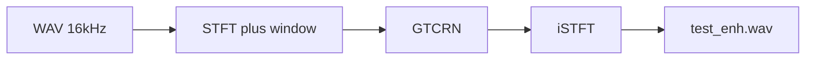
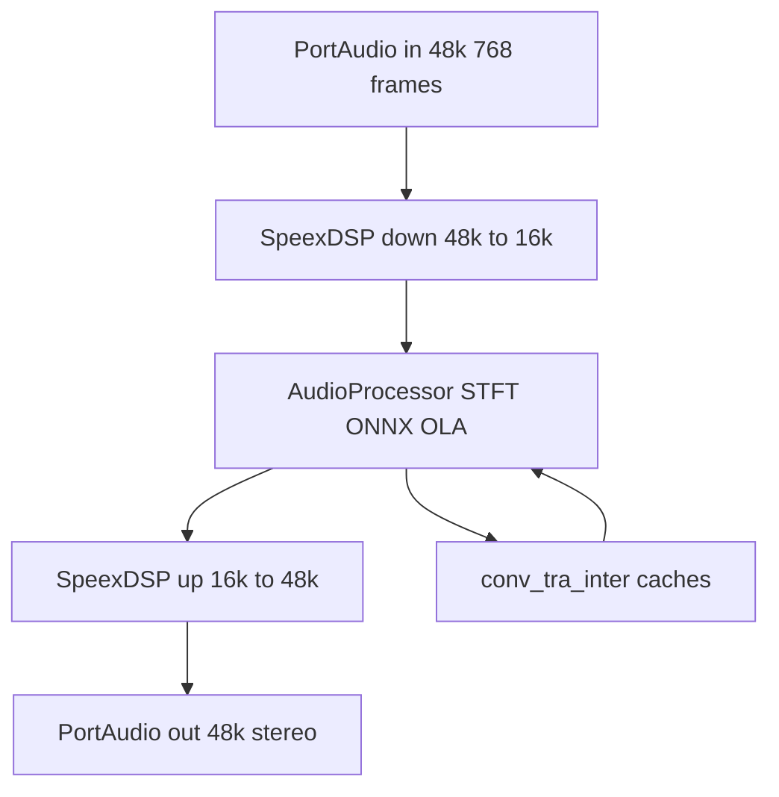

# GTCRN 项目架构指南

本文档面向维护与二次开发，说明本仓库的**代码组织、模块边界与典型数据流**。论文背景与基准指标见 [README.md](README.md)。

---

## 1. 项目概述

### 1.1 定位

- **GTCRN**（Grouped Temporal Convolutional Recurrent Network）为 ICASSP 2024 论文提出的超轻量语音增强模型；官方实现见本仓库 [README.md](README.md)。
- 本仓库在官方基础上的工程化扩展包括：
  - **离线整段推理**（PyTorch 非流式 `GTCRN`）
  - **Python 实时监听**（PyTorch 流式 `StreamGTCRN` + PortAudio/sounddevice）
  - **ONNX 导出与简化**（供跨平台部署）
  - **C++ 实时程序**（Windows 与 Linux，ONNX Runtime + STFT/iSTFT）
  - **嵌入式路径**（如 RK3568：脚本部署、48 kHz 设备 I/O）
  - **LADSPA 插件**（社区维护，见 [ladspa/README.md](ladspa/README.md)）

### 1.2 音频与模型约束

| 项目 | 说明 |
|------|------|
| 模型采样率 | **16 kHz**（与训练/checkpoint 一致） |
| STFT | `n_fft=512`，`hop_length=256`，`win_length=512`，窗为 `hann_window ** 0.5`（与 PyTorch 一致） |
| Python 离线/流式 | 直接以 16 kHz 处理（见 [infer.py](infer.py)） |
| Linux C++ 常见 I/O | 许多 USB 声卡仅支持 **48 kHz**；程序通过 [AudioProcessor48k](cpp_src/AudioProcessor.h) 使用 **SpeexDSP** 在 48 kHz 与 16 kHz 之间重采样，内部仍跑 16 kHz 模型 |

---

## 2. 仓库顶层目录与职责

| 区域 | 路径 | 职责摘要 |
|------|------|----------|
| 非流式模型 | [gtcrn.py](gtcrn.py) | 离线/训练侧 `GTCRN`：ERB、SFE、TRA、ShuffleNetV2 风格块、DPGRNN 等 |
| 流式模型 | [stream/](stream/) | `StreamGTCRN`、`StreamTRA` 等；时间维因果、显式 cache；思路与 [TRT-SE](https://github.com/Xiaobin-Rong/TRT-SE) 流式化一致 |
| 流式卷积原语 | [stream/modules/convolution.py](stream/modules/convolution.py) | `StreamConv2d`、`StreamConvTranspose2d` 等 |
| 权重迁移 | [stream/modules/convert.py](stream/modules/convert.py) | `convert_to_stream`：离线权重映射到流式模块 |
| 检查点 | `checkpoints/` | 预训练权重（如 `model_trained_on_dns3.tar`） |
| ONNX 产物 | `onnx_models/`（构建生成） | `gtcrn.onnx`、`gtcrn_simple.onnx` 等 |
| C++ 源码 | [cpp_src/](cpp_src/) | `AudioProcessor`、`main` / `main_linux`、`CMakeLists` |
| LADSPA | [ladspa/](ladspa/) | 基于 ONNX Runtime 的实时插件 |
| 测试音频 | `test_wavs/` | 如 `test.wav` / `test_enh.wav`（部分可能被 .gitignore） |
| 运维与部署脚本 | 根目录 `deploy_*.py`、`diag_*.py`、`fix_*.py` 等 | RK3568 上传编译、PulseAudio/ALSA 诊断与修复（见第 7 节） |

---

## 3. 模型与算法模块（Python）

### 3.1 非流式：`GTCRN`（[gtcrn.py](gtcrn.py)）

- **ERB**：将线性频带映射到 ERB 子带（`bm` / `bs`），部分权重固定为滤波器组。
- **SFE**（Subband Feature Extraction）：沿频率维 unfold，扩展通道。
- **TRA**（Temporal Recurrent Attention）：时序注意，与流式版结构对应但无跨帧 hand-written cache。
- **主干**：Group Temporal Convolution 块 + **DPGRNN**；输入输出为 STFT 的实部/虚部张量 `(B, F, T, 2)` 形式（与 `infer.py` 中 `view_as_real` 一致）。

### 3.2 流式：`StreamGTCRN`（[stream/gtcrn_stream.py](stream/gtcrn_stream.py)）

- 与 `GTCRN` 功能对齐，但卷积/反卷积替换为 **StreamConv2d / StreamConvTranspose2d**，RNN 部分使用 **显式 cache**（`conv_cache`、`tra_cache`、`inter_cache`）。
- **单时间步**前向：输入频谱切片 `(B, 257, 1, 2)`，输出同形状增强谱，并回写各 cache，便于逐帧 ONNX 推理。

### 3.3 `convert_to_stream`（[stream/modules/convert.py](stream/modules/convert.py)）

- 将非流式 `GTCRN` 的 `state_dict` 拷入 `StreamGTCRN`。
- 处理键名差异（如 `Conv2d.` / `ConvTranspose2d.` 前缀）；对 **ConvTranspose2d** 权重按实现版本做 `flip` / `permute`，保证流式与离线一致。

### 3.4 流式卷积（[stream/modules/convolution.py](stream/modules/convolution.py)）

- 时间维 **因果**：要求时间 padding 为 0；forward 接收 `cache`，输出更新后的 cache。
- 设计目标之一：**ONNX 导出**时 cache 为张量而非 Python list。

### 3.5 训练相关：[loss.py](loss.py)

- 提供训练用损失；本仓库主路径为**推理与部署**。完整训练流程可参考 README 中的 [SEtrain](https://github.com/Xiaobin-Rong/SEtrain)。

---

## 4. Python 应用与工具链

| 脚本 | 作用 |
|------|------|
| [infer.py](infer.py) | 加载 `GTCRN` + checkpoint；`stft`/`istft`（`return_complex=True`）；支持立体声按 batch 维处理；`denoise_strength` 干湿混合、`normalize_audio` 可选；输出 `test_wavs/test_enh.wav` |
| [realtime_infer.py](realtime_infer.py) | `sounddevice` 实时采集与播放；按键切换原声/降噪；使用 `StreamGTCRN`，需将 `stream` 加入 `sys.path` |
| [export_onnx.py](export_onnx.py) | checkpoint → `StreamGTCRN` → [fuse_bn.py](fuse_bn.py) 融合 BN → `torch.onnx.export(..., dynamo=False, opset_version=17)` → `onnxsim` 得到 `onnx_models/gtcrn_simple.onnx` |
| [fuse_bn.py](fuse_bn.py) | 将 `StreamGTConvBlock` 等中的 Conv/BN 融合，规避导出器在分组卷积上的 BN 问题 |
| [validate_cpp.py](validate_cpp.py) | 用 NumPy FFT + ONNX Runtime + OLA 模拟 C++ 链路，与 PyTorch 流式输出对比 |

**注意**：`stream/gtcrn_stream.py` 末尾 `if __name__ == "__main__"` 中另有一套较早的 ONNX 示例（opset 等可能与当前 [export_onnx.py](export_onnx.py) 不一致）；**以 `export_onnx.py` 与 [模型转换注意事项.md](模型转换注意事项.md) 为准**。

---

## 5. C++ 实时推理架构

### 5.1 `AudioProcessor`（[cpp_src/AudioProcessor.h](cpp_src/AudioProcessor.h)、[AudioProcessor.cpp](cpp_src/AudioProcessor.cpp)）

- **采样率 16 kHz**，每块 **256 样本**（约 16 ms）。
- **DSP**：pocketfft 做 STFT/iSTFT；Hann 窗与 PyTorch **周期性** Hann（分母为 `N`）对齐。
- **ONNX Runtime**：输入 `mix` 与 `conv_cache`、`tra_cache`、`inter_cache`；输出 `enh` 与更新后的三份 cache；内部 **overlap-add** 重建时域。
- **干湿混合**：由 `denoise_strength` 在时域混合原声与增强声（与 Python 侧语义一致）。

### 5.2 `AudioProcessor48k`

- I/O：**48000 Hz**，块长 **768** 样本（与 16 kHz 下 256 样本等时长）。
- 内部持有两个 **SpeexDSP** resampler：输入 48k→16k → `AudioProcessor` → 16k→48k 输出。

### 5.3 程序入口

- **Windows**：[cpp_src/main.cpp](cpp_src/main.cpp) — PortAudio，`conio` 非阻塞键；默认 16 kHz（与桌面声卡常见配置一致）。
- **Linux / 嵌入式**：[cpp_src/main_linux.cpp](cpp_src/main_linux.cpp) — `termios` 非阻塞键；**优先 USB 双工**，其次 USB 输入 + rk809 输出，再 PulseAudio / default；`AudioProcessor48k`。

### 5.4 构建系统

- **Windows**：[cpp_src/CMakeLists.txt](cpp_src/CMakeLists.txt) — `FetchContent` 拉取 pocketfft、ONNX Runtime、PortAudio；构建后复制 DLL 与 `gtcrn_simple.onnx`。
- **Linux（含 RK3568）**：[cpp_src/CMakeLists_linux.txt](cpp_src/CMakeLists_linux.txt) — 部署时常**复制为** `cpp_src/CMakeLists.txt`；依赖系统 **portaudio**、**speexdsp**、预解压的 **onnxruntime-linux-aarch64**（见 [deploy_rk3568.py](deploy_rk3568.py)）。

---

## 6. 嵌入式部署与运行

- **[deploy_rk3568.py](deploy_rk3568.py)**：Paramiko SSH/SFTP，上传 `AudioProcessor.*`、`main_linux.cpp`、`CMakeLists_linux.txt`（为 `CMakeLists.txt`）、`gtcrn_simple.onnx`；远端 `cmake` + `make`；在设备上生成 `~/gtcrn/run.sh`。
- **[run_rk3568.sh](run_rk3568.sh)**：设置 `LD_LIBRARY_PATH`、可选将 PulseAudio 默认 sink/source 指向 USB、启动 `gtcrn_realtime`（可过滤部分 ALSA 日志）。

具体操作命令、声卡与音量调试见 [运行程序.md](运行程序.md)。

---

## 7. 运维与设备脚本（归类说明）

根目录下大量 `diag_*.py`、`fix_*.py`、`persist_*.py`、`set_*.py` 等用于在 **RK3568 / Linux** 上排查 PulseAudio、ALSA、`udev`、`rc.local` 与默认设备持久化等问题。它们**不属于核心算法链路**，随现场环境迭代；新增功能时以 [deploy_rk3568.py](deploy_rk3568.py) + [run_rk3568.sh](run_rk3568.sh) + C++ 源码为交付主干。

---

## 8. 端到端数据流

### 8.1 离线（PyTorch 非流式）

### 8.2 实时 C++（48 kHz 设备，带状态闭环）

### 8.3 实时 Python（PyTorch 流式）

麦克风 16 kHz → 分帧 STFT → `StreamGTCRN`（cache 在 Python 张量中）→ iSTFT → 播放；无 ONNX。

---

## 9. 相关文档索引

| 文档 | 内容 |
|------|------|
| [README.md](README.md) | 论文引用、性能表、预训练模型说明、官方 News |
| [依赖环境说明.md](依赖环境说明.md) | Python/C++ 依赖、库版本、编译与运行步骤 |
| [模型转换注意事项.md](模型转换注意事项.md) | BN 融合、旧版 ONNX 导出、`dynamo=False`、IR 版本与 ORT 兼容性等 |
| [运行程序.md](运行程序.md) | Windows C++ / Python 实时 / RK3568 与声卡实用命令 |
| [stream/README.md](stream/README.md) | 流式与 TRT-SE 关系简述 |
| [ladspa/README.md](ladspa/README.md) | LADSPA 插件构建方式 |

---

## 10. 快速对照：从改模型到上板

1. 修改或替换 checkpoint 后，在 PC 上跑通 [infer.py](infer.py) 或流式脚本验证。
2. 执行 [export_onnx.py](export_onnx.py) 生成 `onnx_models/gtcrn_simple.onnx`；若导出异常，查 [模型转换注意事项.md](模型转换注意事项.md)。
3. 可选： [validate_cpp.py](validate_cpp.py) 对齐 Python 与 ONNX 逐帧行为。
4. Windows：在 `cpp_src/build` 用 Visual Studio 工具链按 [CMakeLists.txt](cpp_src/CMakeLists.txt) 构建。
5. RK3568：配置依赖见 [依赖环境说明.md](依赖环境说明.md)，执行 [deploy_rk3568.py](deploy_rk3568.py)，板上 [run_rk3568.sh](run_rk3568.sh) 或手动设置 `LD_LIBRARY_PATH` 运行 `gtcrn_realtime`。
